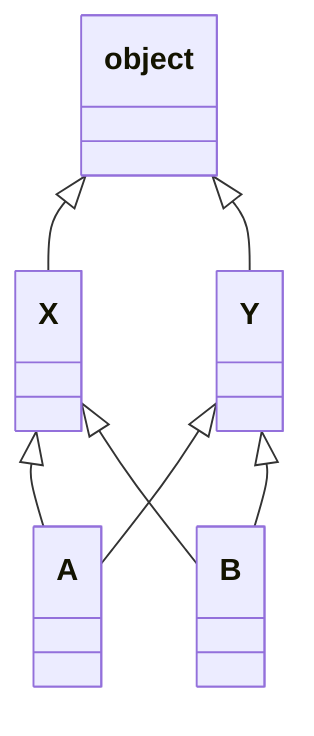

```mermaid
classDiagram
    direction TB
    class object
    class X
    class Y
    class A
    class B

    object <|-- X
    object <|-- Y
    X <|-- A
    Y <|-- A
    Y <|-- B
    X <|-- B

```